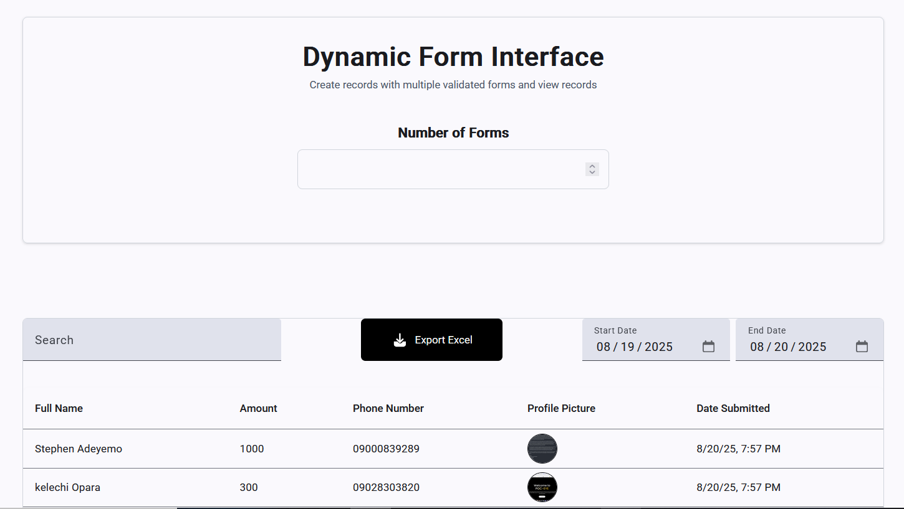

# Records Dashboard

A React + TypeScript application for managing and filtering records. Features include date filtering, profile picture upload, and exporting filtered records to **Excel (.xlsx)** using [SheetJS](https://github.com/SheetJS/sheetjs).

---

## 🚀 Features

- Add and view records  
- Upload profile picture (stored as `File`)  
- Filter records by date range  
- Export filtered records to **Excel (.xlsx)**  
- Responsive table view  

## 🖼️ Screenshots

- **Homepage**  


---

## ⚙️ Tech Stack

- Angular 20  
- TypeScript  
- Tailwind CSS
- [Angular Material](https://ui.shadcn.com/) for customized components  
- [SheetJS (xlsx)](https://github.com/SheetJS/sheetjs) for Excel export  

---

## 🔧 Installation & Setup

1. **Clone the repository**

   ```bash
    git clone https://github.com/godwinopara/angular-dynamic-form.git
    cd angular-dynamic-form
    ```
2. **Install Dependencies** 

    ```bash
    npm install
    or 
    yarn install
    ```

## Development server

To start a local development server, run:

```bash
ng serve
```

Once the server is running, open your browser and navigate to `http://localhost:4200/`. The application will automatically reload whenever you modify any of the source files.


## 📝 Usage

1. Input the number of form you want to add records with
2. Add a new record with FullName, Amount, Phone Number, and Profie Picture.  
3. Use the date filter and search filter to narrow records.  
4. Click "Export to Excel" to download filtered records. 
